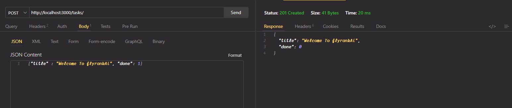

# Task Management API

A simple REST API built with **Express.js** and **SQLite** for managing tasks. The application supports creating, reading, updating, and deleting tasks (CRUD) and automatically creates and seeds the database on first run.

---

## Why SQLite?

SQLite was chosen for this project because:

- It stores the entire database in a **single file** (`tasks.db`).
- It requires **zero setup**—no separate database server needs to be installed or configured.
- The database **persists between application restarts**, so data is not lost when the server stops.
- It is lightweight, fast, and well suited for small applications and assignments.

---

## Database

The application uses a SQLite database stored in:

```text
tasks.db
```

- The database file is **created automatically** the first time the application starts.
- The application automatically:
  - Creates the `tasks` table if it does not exist.
  - Seeds the database with three sample tasks if the table is empty.

- The database file is included in `.gitignore` so that each new clone of the repository starts with a fresh database that is created automatically.

---

## Getting Started

### Install dependencies

```bash
pnpm install
```

### Start the application

```bash
pnpm start
```

Running this command will automatically:

- Create `tasks.db` if it does not already exist.
- Create the required table.
- Seed the database with three sample tasks.
- Start the Express server.

No manual database setup is required.

---

## API Endpoints

| Method | Endpoint     | Description             |
| ------ | ------------ | ----------------------- |
| GET    | `/tasks`     | Retrieve all tasks      |
| GET    | `/tasks/:id` | Retrieve a task by ID   |
| POST   | `/tasks`     | Create a new task       |
| PATCH  | `/tasks/:id` | Update an existing task |
| DELETE | `/tasks/:id` | Delete a task           |

---

## Example SQL Query

The following SQL query was executed during Stage 4:



````

This query returns all tasks that have not yet been completed.

---

## Project Structure

```text
.
├── app.js
├── database.js
├── routes/
├── package.json
├── tasks.db (created automatically)
└── README.md
````

---

## Technologies Used

- Node.js
- Express.js
- SQLite
- better-sqlite3
